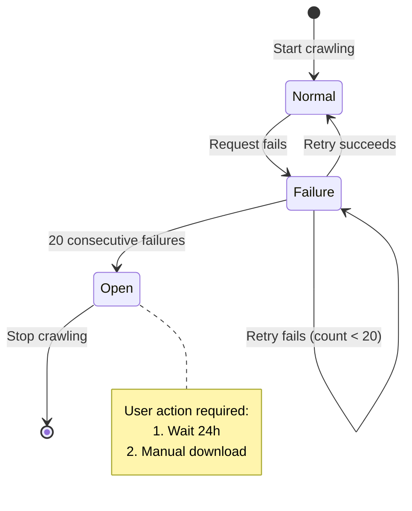
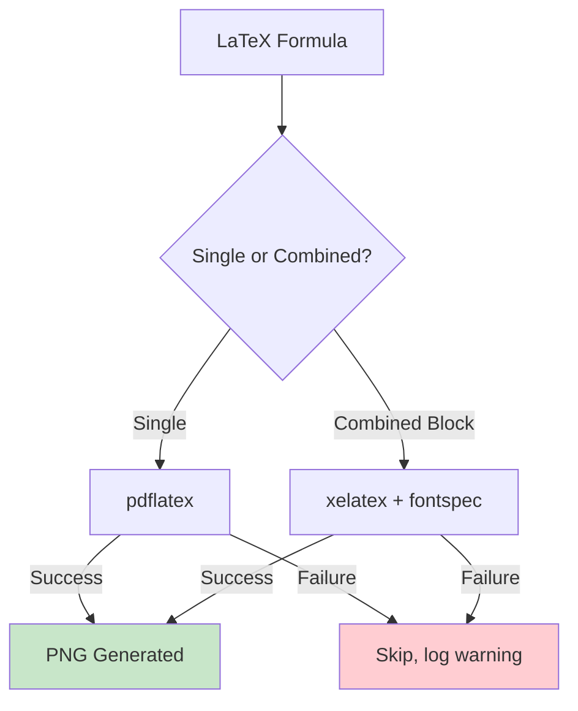

# Error Handling and Reliability Strategy

Comprehensive guide to error handling patterns and fault tolerance in Feynman Bot.

---

## Circuit Breaker Pattern (Crawler)



**Purpose**: Prevent cascading failures when Cloudflare blocks crawler

**Implementation**: `src/crawler/scraper.py`
- Tracks consecutive failures
- Stops after 20 failures to avoid wasting resources
- User must wait 24 hours or manually download chapters

---

## Graceful Degradation (Rendering)



**Purpose**: Ensure lessons deliver even if formulas fail to render

**Strategy**:
1. Try primary renderer (pdflatex for single, xelatex for combined)
2. If fails, log warning and skip image
3. Lesson content still delivered without images

**Result**: Users get text-based lesson; missing formulas noted in logs

---

## LLM Provider Error Handling

**Location**: `src/llm/provider.py`

### Retry Logic with Exponential Backoff

```python
async def generate_with_retry(
    self,
    system_prompt: str,
    user_prompt: str,
    history: Optional[List[dict]] = None,
) -> str:
    """Generate with automatic retry on transient errors."""

    for attempt in range(1, self.max_retries + 1):
        try:
            return await self._generate_once(system_prompt, user_prompt, history)
        except (ConnectionError, TimeoutError) as e:
            if attempt == self.max_retries:
                raise LLMRetryExhaustedError(f"Failed after {self.max_retries} retries") from e

            delay = min(
                self.retry_base_delay * (2 ** (attempt - 1)),
                self.retry_max_delay
            )
            await asyncio.sleep(delay)
```

### Configuration (config.yaml)

```yaml
llm:
  enhancement:
    model: claude-sonnet-4-6
    max_retries: 3
    retry_base_delay: 2
    retry_max_delay: 30

  qa:
    model: deepseek-chat
    max_retries: 3
    retry_base_delay: 2
    retry_max_delay: 30
```

### Error Classes

```python
class LLMError(Exception):
    """Base exception for LLM operations."""
    pass

class LLMRetryExhaustedError(LLMError):
    """All retry attempts failed."""
    pass
```

### Retryable Errors

- `ConnectionError`: Network connectivity issues
- `TimeoutError`: API response timeout

### Non-Retryable Errors

- Authentication errors (invalid API key)
- Rate limit errors (quota exceeded)

---

## Bot Handler Error Handling

**Location**: `src/bot/handlers.py`

### Global Exception Handler

```python
async def error_handler(update: Update, context: ContextTypes.DEFAULT_TYPE):
    """Catch and gracefully handle all bot errors."""

    logger.error(f"Exception: {context.error}")

    if isinstance(context.error, LLMRetryExhaustedError):
        await context.bot.send_message(
            chat_id=update.effective_chat.id,
            text="Xin lỗi, dịch vụ AI hiện tạm thời không khả dụng. Vui lòng thử lại sau."
        )
    elif isinstance(context.error, Exception):
        await context.bot.send_message(
            chat_id=update.effective_chat.id,
            text="Lỗi hệ thống. Vui lòng thử lại sau hoặc liên hệ admin."
        )
```

### User-Friendly Error Messages

**Vietnamese error dict** in handlers:

```python
ERROR_MESSAGES = {
    "no_lesson": "Không có bài học nào để gửi ngay bây giờ.",
    "no_quiz": "Không có câu quiz nào cho bài học này.",
    "llm_unavailable": "Dịch vụ AI hiện tạm thời không khả dụng.",
    "timeout": "Yêu cầu hết thời gian. Vui lòng thử lại.",
    "db_error": "Lỗi cơ sở dữ liệu. Vui lòng liên hệ admin.",
}
```

---

## Database Error Recovery

**Location**: `src/knowledge/db.py`

### Connection Resilience

```python
async def get_db():
    """Context manager with automatic reconnection."""
    try:
        async with aiosqlite.connect("data/feynman.db") as conn:
            yield conn
    except aiosqlite.Error as e:
        logger.error(f"Database error: {e}")
        # Automatically retries on next call
```

### WAL Mode (Write-Ahead Logging)

```python
async def init_db(config):
    """Enable WAL mode for crash recovery."""
    async with aiosqlite.connect(db_path) as conn:
        await conn.execute("PRAGMA journal_mode=WAL")
        await conn.commit()
```

**Benefits**:
- Automatic crash recovery
- Better concurrency
- Minimal data loss on unexpected shutdown

---

## Pipeline Stage Error Recovery

### Resumable Pipeline

Each stage tracks completion:

```
Stage 1 (Crawl):  Skips chapters already in database
Stage 2 (Parse):  Skips sections already parsed
Stage 3 (Chunk):  Skips sections already chunked
Stage 4 (Enhance):  Skips lessons with pending_prompts done
Stage 5 (Render):  Skips lessons already rendered
```

### Run Specific Stage

```bash
python pipeline.py --stage enhance      # Generate prompts only
python pipeline.py --stage render       # Re-render only
```

### Example: Resume Enhancement

```bash
# After LLM API error:
python pipeline.py --stage enhance --import  # Retries import without re-processing
```

---

## Monitoring and Observability

### Structured Logging

**File**: `src/utils.py`

```python
def setup_logging(config):
    """Configure file + console logging."""
    logging.basicConfig(
        level=logging.INFO,
        format='%(asctime)s - %(name)s - %(levelname)s - %(message)s',
        handlers=[
            logging.FileHandler(config['logging']['file']),
            logging.StreamHandler()
        ]
    )
```

### Error Categorization

Errors logged with context:

```
ERROR (LLM): "Claude API timeout" - attempt 2/3, retry_delay=4s
ERROR (Crawler): "Cloudflare block" - failure_count=15/20
ERROR (Renderer): "pdflatex failed" - formula_hash=abc123, fallback=skip
```

---

## Health Check System

**Location**: `src/monitoring/health.py`

### Endpoint Checks

```python
async def full_health_check():
    """Run all health checks."""
    checks = {
        "database": await check_database(),
        "llm_api": await check_llm_api(),
        "telegram_api": await check_telegram_api(),
    }
    return {
        "status": "healthy" if all(checks.values()) else "degraded",
        "checks": checks
    }
```

### Health Status Codes

- **Healthy**: All systems operational
- **Degraded**: One service unavailable but bot can function
- **Down**: Critical service failure

---

## Recovery Procedures

### If Crawler Blocks (Circuit Breaker Open)

1. Wait 24 hours
2. Cloudflare block may auto-clear
3. Or manually download chapters and place in data/raw/

### If LLM API Fails

1. Enhancement pauses automatically
2. Already-enhanced lessons still deliver
3. Retry when API recovers
4. No lessons lost

### If Bot Crashes

1. Systemd auto-restarts (configured in feynman-bot.service)
2. Scheduler resumes from last completion
3. Missed lessons not sent; resumed next scheduled time
4. No duplicate deliveries due to tracking

### If Database Corrupts

1. WAL mode enables automatic recovery
2. Check feynman.db-wal file exists
3. If needed, restore from latest backup
4. See [Deployment Guide](./deployment-guide.md#backup--recovery)

---

## Failure Scenario Reference

| Scenario | Impact | Recovery Time |
|----------|--------|---|
| Crawler blocked | No new chapters | 24 hours |
| LLM API down | Enhancement pauses | < 1 hour |
| Telegram API error | Single message fails | Auto-retry |
| LaTeX render fails | Image missing in lesson | Lesson still delivered |
| Database corrupted | Restart fails | WAL auto-recovery |
| Bot process crashes | Service stops | Systemd auto-restart (30s) |

---

## Best Practices

1. **Log Everything**: Use structured logging with context
2. **Fail Gracefully**: Skip non-critical operations, continue with degraded service
3. **Retry Transient Errors**: Use exponential backoff for network issues
4. **Monitor Health**: Run health checks periodically
5. **Document Recovery**: Keep runbooks for manual intervention
6. **Test Failover**: Simulate failures and verify recovery
