# Feynman Bot - System Architecture

## High-Level Architecture

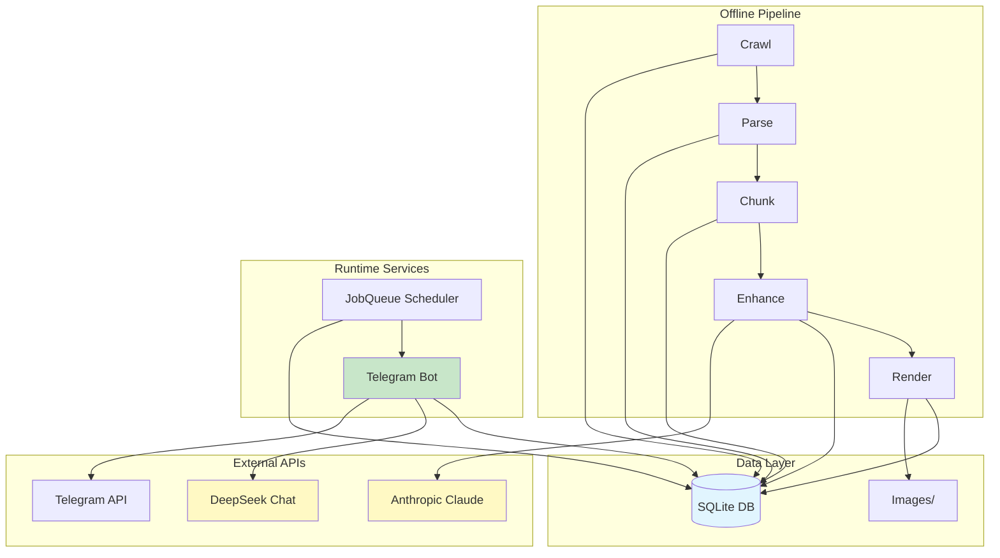

---

## Component Overview

### 1. Content Pipeline (Offline)

**Purpose**: Transform raw Feynman Lectures into enhanced lessons

**Entry Point**: `pipeline.py`

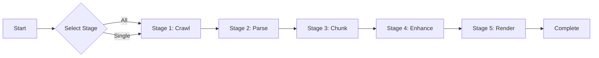

#### Stage Details

| Stage | Input | Output | Location |
|-------|-------|--------|----------|
| **Crawl** | Feynman website | `chapters` table | `src/crawler/scraper.py` |
| **Parse** | `chapters.raw_html` | `sections` table | `src/crawler/parser.py` |
| **Chunk** | `sections` rows | `lessons` stubs | `src/content/chunker.py` |
| **Enhance** | `lessons` (pending) | `lessons.content_enhanced` | `src/content/enhancer.py` |
| **Render** | LaTeX formulas | `lessons.math_images_json` | `src/renderer/math_renderer.py` |

### 2. Telegram Bot (Runtime)

**Purpose**: Deliver lessons and handle user interaction

**Entry Point**: `main.py`

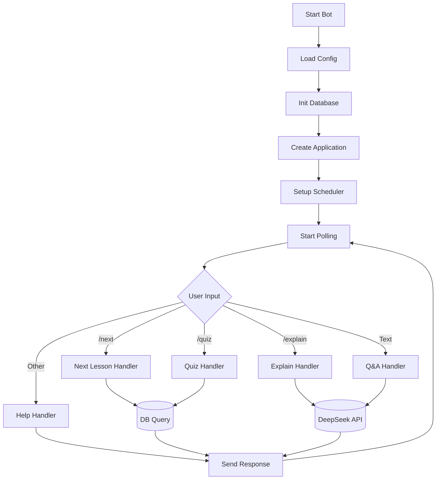

### 3. Scheduler

**Purpose**: Automated lesson delivery at configured times

**Location**: `src/bot/scheduler.py`

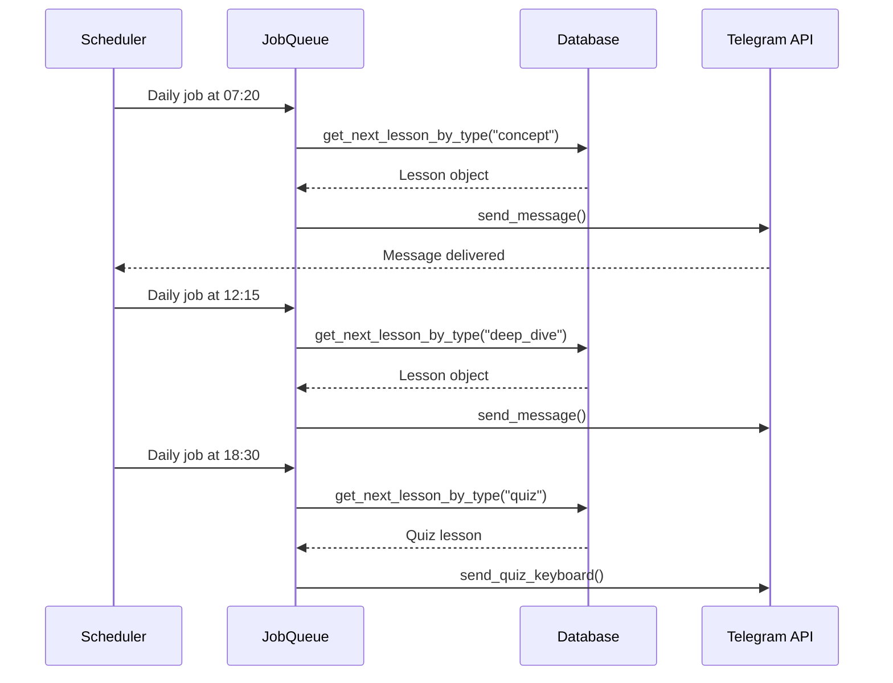

---

## Data Flow Diagrams

### Pipeline Data Flow

```mermaid
flowchart LR
    subgraph "Stage 1: Crawl"
        A1[feynmanlectures.caltech.edu] --> A2[Playwright Browser]
        A2 --> A3[chapters table]
    end

    subgraph "Stage 2: Parse"
        B1[chapters.raw_html] --> B2[BeautifulSoup Parser]
        B2 --> B3[sections table]
    end

    subgraph "Stage 3: Chunk"
        C1[sections.content_text] --> C2[Chunker]
        C2 --> C3[lessons stubs]
    end

    subgraph "Stage 4: Enhance"
        D1[lessons pending] --> D2[LLM Provider]
        D2 --> D3[lessons enhanced]
    end

    subgraph "Stage 5: Render"
        E1[LaTeX formulas] --> E2[Math Renderer]
        E2 --> E3[PNG images]
    end

    A3 --> B1
    B3 --> C1
    C3 --> D1
    D3 --> E1
```

### Bot Runtime Flow

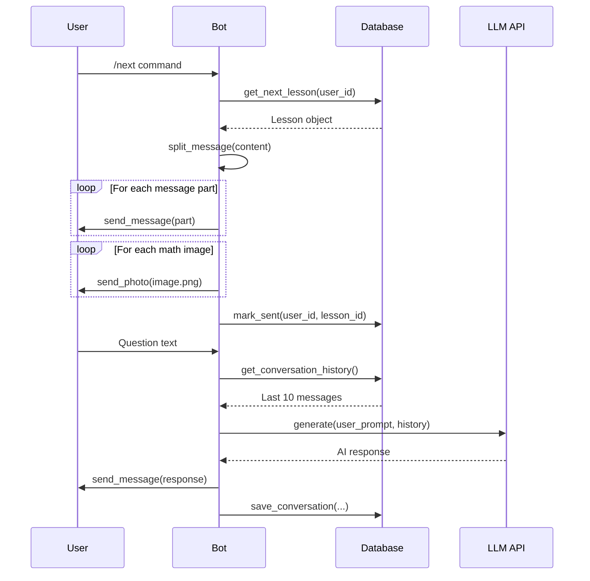

---

## Database Schema

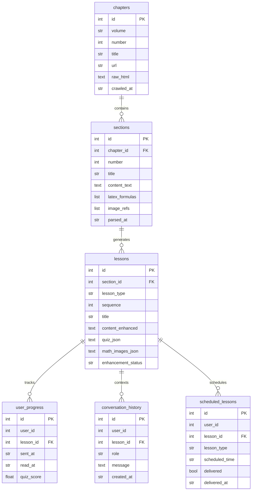

---

## Module Interactions

### Crawler Module

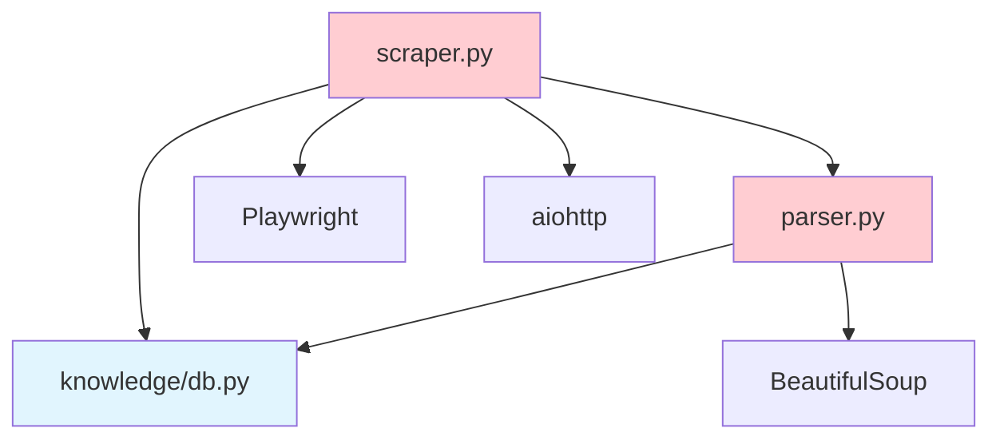

### Content Module

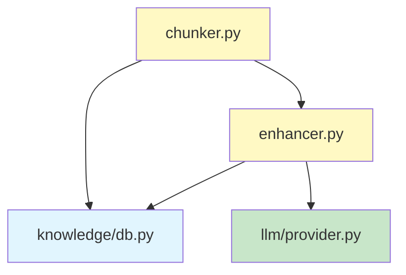

### Bot Module

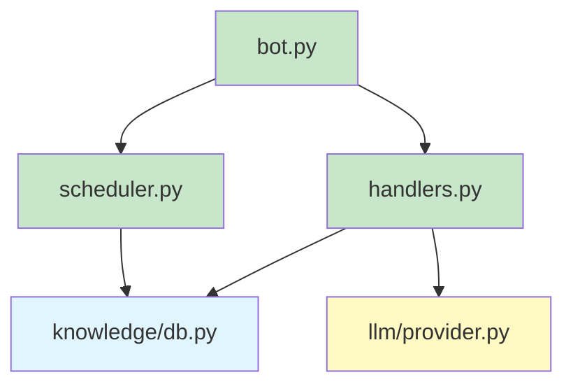

---

## LLM Provider Architecture

```mermaid
classDiagram
    class LLMProvider {
        <<interface>>
        +generate(system, user, history) str
        +generate_with_tools(system, user, tools) str
    }

    class AnthropicProvider {
        -client: Anthropic
        -model: str
        -request_delay: float
        +generate(system, user, history) str
    }

    class OpenAIProvider {
        -client: OpenAI
        -model: str
        -base_url: str
        +generate(system, user, history) str
    }

    LLMProvider <|.. AnthropicProvider
    LLMProvider <|.. OpenAIProvider

    class build_enhancement_provider() {
        Returns AnthropicProvider for Claude Haiku
    }

    class build_qa_provider() {
        Returns OpenAIProvider for DeepSeek
    }

    build_enhancement_provider ..> AnthropicProvider
    build_qa_provider ..> OpenAIProvider
```

---

## Message Flow: Lesson Delivery

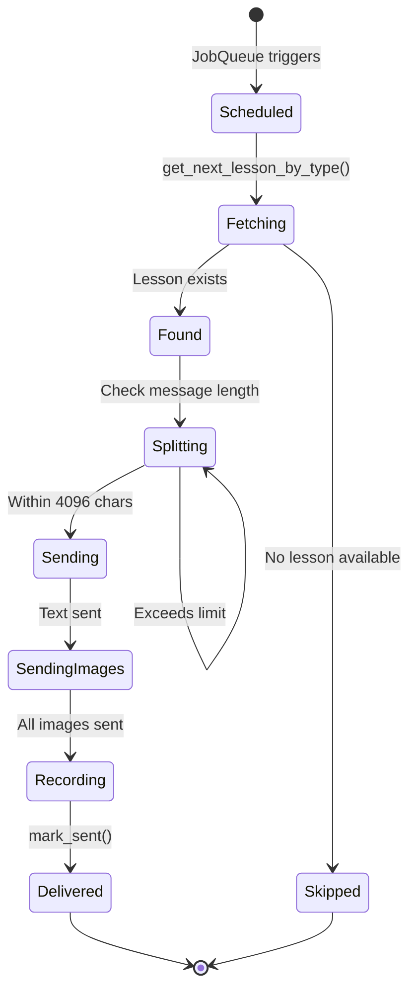

---

## Error Handling Strategy

### Circuit Breaker Pattern (Crawler)

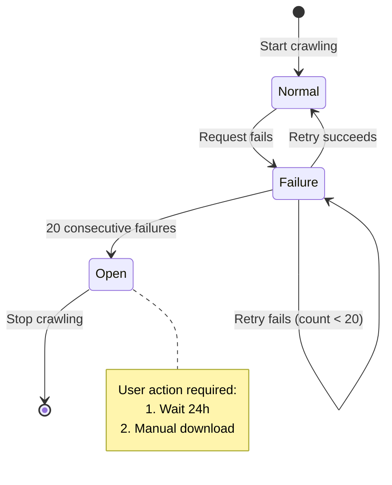

### Graceful Degradation (Rendering)

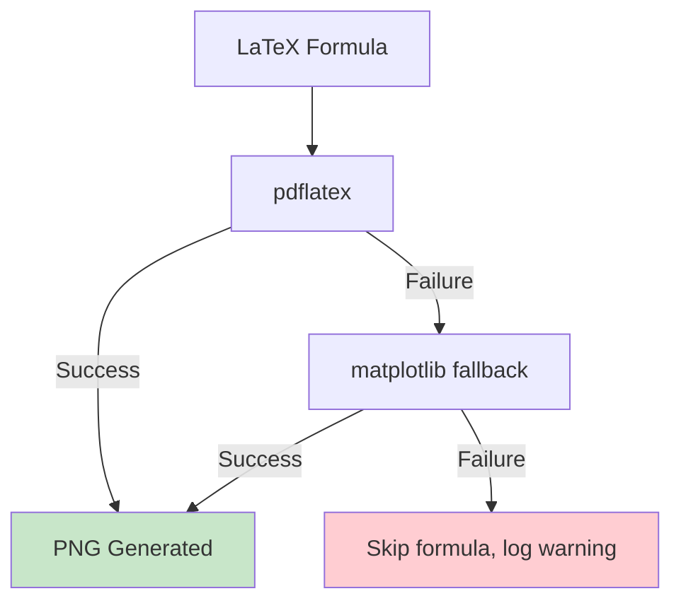

---

## Deployment Architecture

### Development

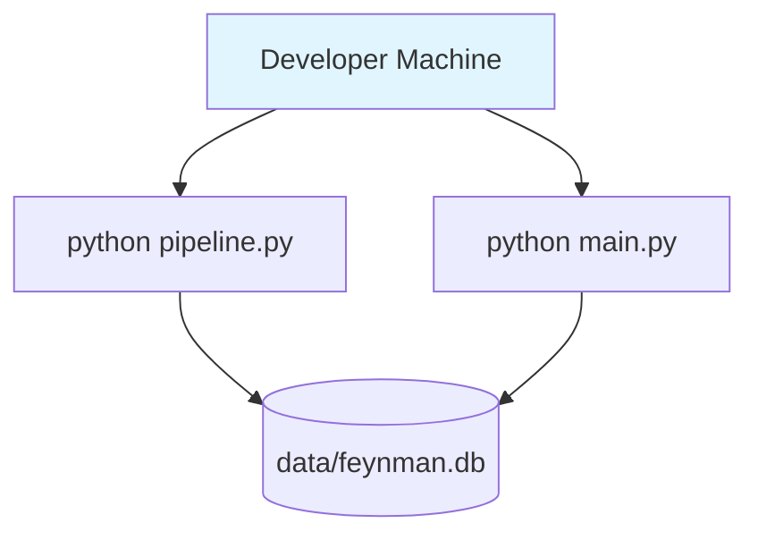

### Production (systemd)

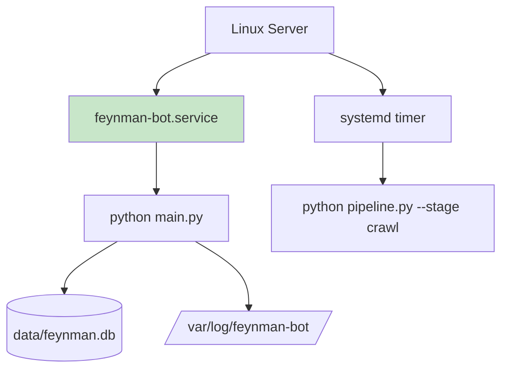

---

## Security Architecture

```mermaid
graph TB
    subgraph "Environment Variables"
        ENV[.env file]
    end

    subgraph "Configuration"
        CONFIG[config.yaml]
    end

    subgraph "Application"
        APP[Python Application]
    end

    subgraph "External APIs"
        ANTH[Anthropic API]
        DEEP[DeepSeek API]
        TG[Telegram API]
    end

    ENV -->|load_config| CONFIG
    CONFIG -->|${VAR} resolution| APP
    APP -->|API Key| ANTH
    APP -->|API Key| DEEP
    APP -->|Token| TG

    style ENV fill:#ffcdd2
    style ANTH fill:#fff9c4
    style DEEP fill:#fff9c4
    style TG fill:#fff9c4
```

---

## Scalability Considerations

### Current Limitations

| Component | Limitation | Impact |
|-----------|------------|--------|
| SQLite | Single-writer concurrency | Bottleneck at 10+ concurrent users |
| Single chat_id | One user per deployment | Not multi-user ready |
| Sequential LLM calls | Slow enhancement pipeline | Hours for full volume |
| No caching | Repeated rendering | Wasted computation |

### Future Scaling Paths

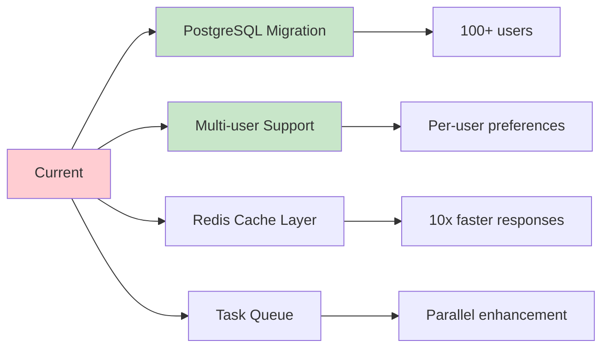

---

## Monitoring & Observability

### Logging Strategy

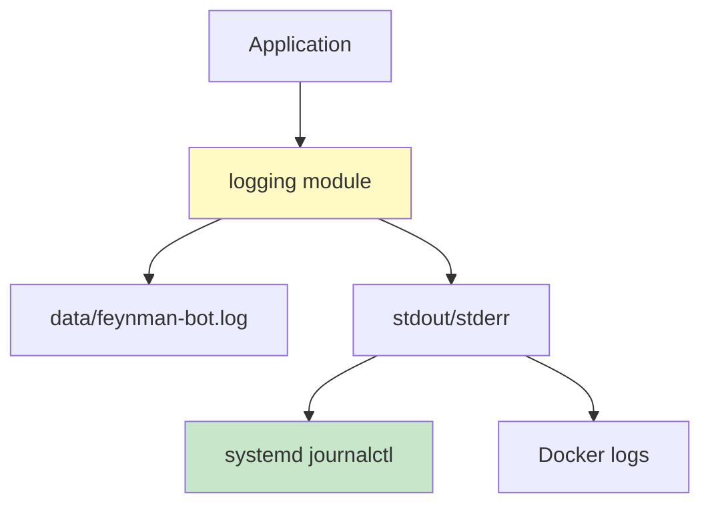

### Log Levels by Component

| Component | Levels Used | Examples |
|-----------|-------------|----------|
| Crawler | INFO, WARNING, ERROR | Pages crawled, failures |
| Parser | DEBUG, INFO | Sections extracted |
| Enhancer | INFO, ERROR | Lessons enhanced |
| Bot | INFO, WARNING | Commands executed |
| Scheduler | INFO, WARNING | Jobs scheduled |
