# Feynman Bot - System Architecture

## High-Level Architecture

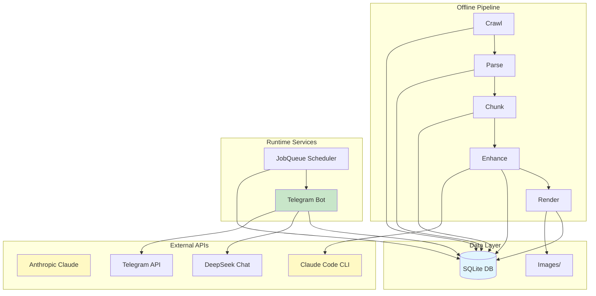

---

## Component Overview

### 1. Content Pipeline (Offline)

**Purpose**: Transform raw Feynman Lectures into enhanced lessons

**Entry Point**: `pipeline.py`

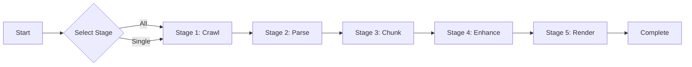

#### Stage Details

| Stage | Input | Output | Location |
|-------|-------|--------|----------|
| **Crawl** | Feynman website | `chapters` table | `src/crawler/scraper.py` |
| **Parse** | `chapters.raw_html` | `sections` table | `src/crawler/parser.py` |
| **Chunk** | `sections` rows | `lessons` stubs | `src/content/chunker.py` |
| **Enhance** | `lessons` (pending) | `lessons.content_enhanced` | `src/content/enhancer.py` + Claude Code |
| **Render** | LaTeX formulas | `lessons.math_images_json` | `src/renderer/math_renderer.py` |
| **Preview** | `lessons` (completed) | Markdown files | `scripts/lesson-preview.py` |
| **Approve** | Human review | `lessons.approval_status` | `scripts/lesson-preview.py` |

### 2. Telegram Bot (Runtime)

**Purpose**: Deliver lessons and handle user interaction

**Entry Point**: `main.py`

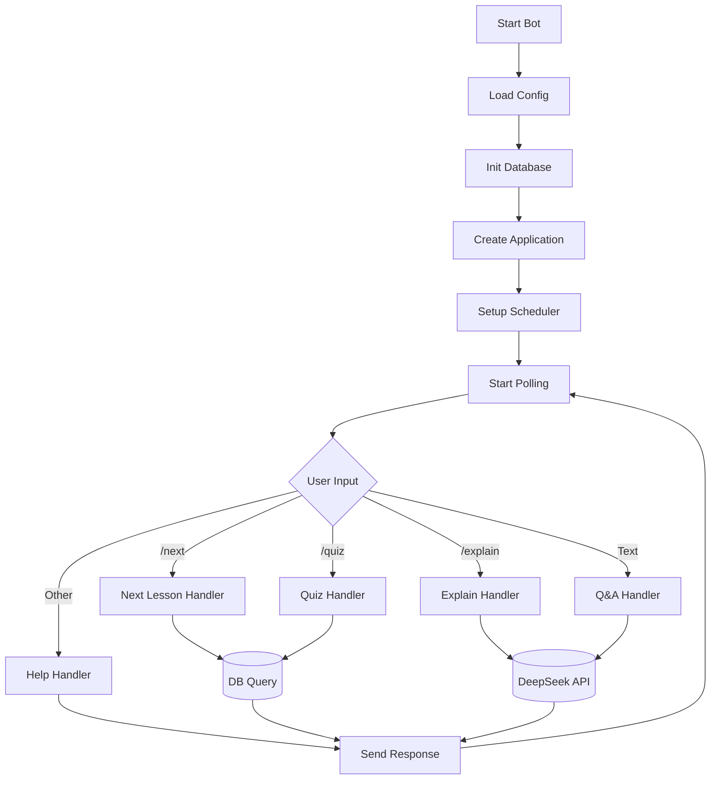

### 3. Scheduler

**Purpose**: Automated lesson delivery at configured times

**Location**: `src/bot/scheduler.py`

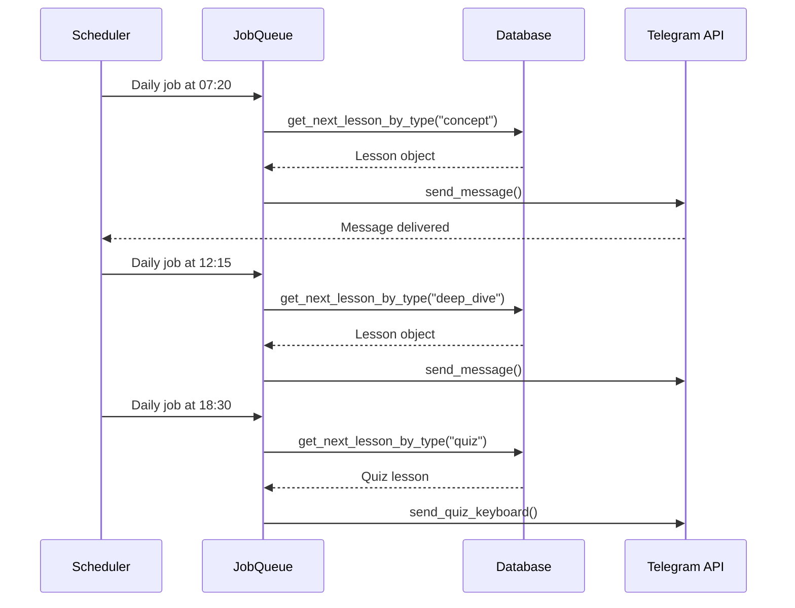

---

## Data Flow Diagrams

### Pipeline Data Flow

```mermaid
flowchart LR
    subgraph "Stage 1: Crawl"
        A1[feynmanlectures.caltech.edu] --> A2[Playwright Browser]
        A2 --> A3[chapters table]
    end

    subgraph "Stage 2: Parse"
        B1[chapters.raw_html] --> B2[Recursive h2/h3 Detection]
        B2 --> B3[sections table<br/>607 sections, 6.5/ch avg]
    end

    subgraph "Stage 3: Chunk"
        C1[sections.content_text] --> C2[Per-Chapter Chunker<br/>Target 2000w]
        C2 --> C3[lessons stubs<br/>843 total, semantic titles]
    end

    subgraph "Stage 4: Enhance"
        D1[lessons pending] --> D2[generate_prompts]
        D2 --> D3[pending_prompts.jsonl]
        D3 --> D4[Claude Code Session]
        D4 --> D5[enhanced_outputs.jsonl]
        D5 --> D6[import_outputs]
        D6 --> D7[lessons enhanced]
    end

    subgraph "Stage 5: Render"
        E1[LaTeX formulas] --> E2[Math Renderer]
        E2 --> E3[PNG images]
    end

    subgraph "Stage 6: Preview & Approve"
        F1[lessons completed] --> F2[Export Markdown]
        F2 --> F3[Human Review]
        F3 --> F4{Approve?}
        F4 -->|Yes| F5[approval_status = approved]
        F4 -->|No| F6[approval_status = rejected]
        F5 --> G1[Ready for Delivery]
    end

    A3 --> B1
    B3 --> C1
    C3 --> D1
    D3 --> E1
    D7 --> F1
```

### Bot Runtime Flow

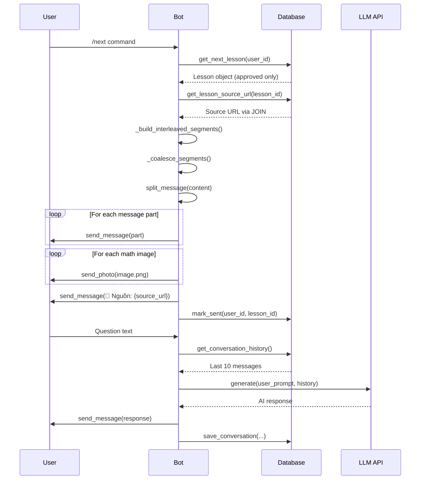

---

## Database Schema

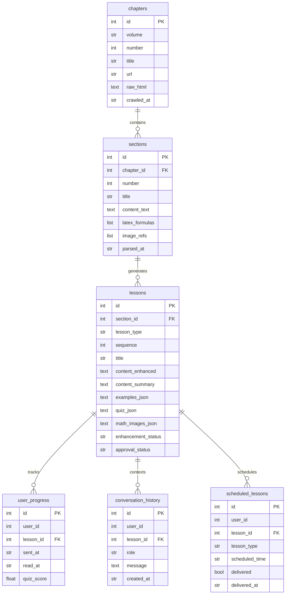

---

## Module Interactions

### Crawler Module

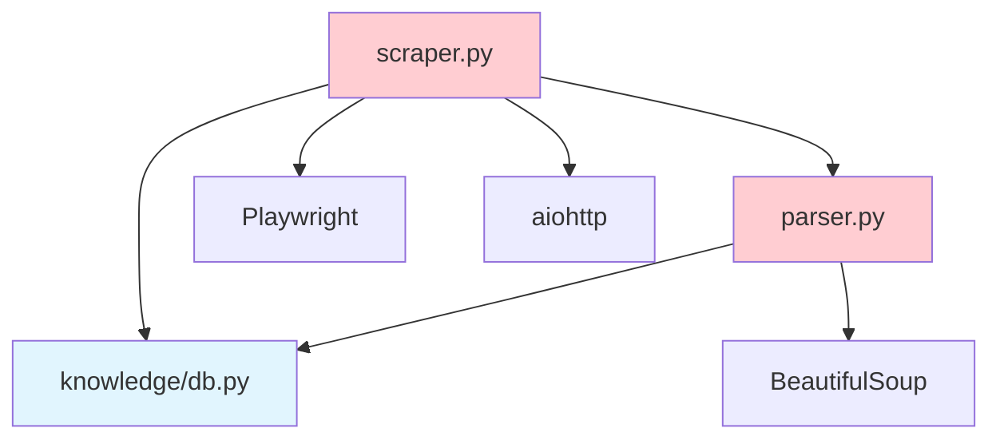

### Content Module

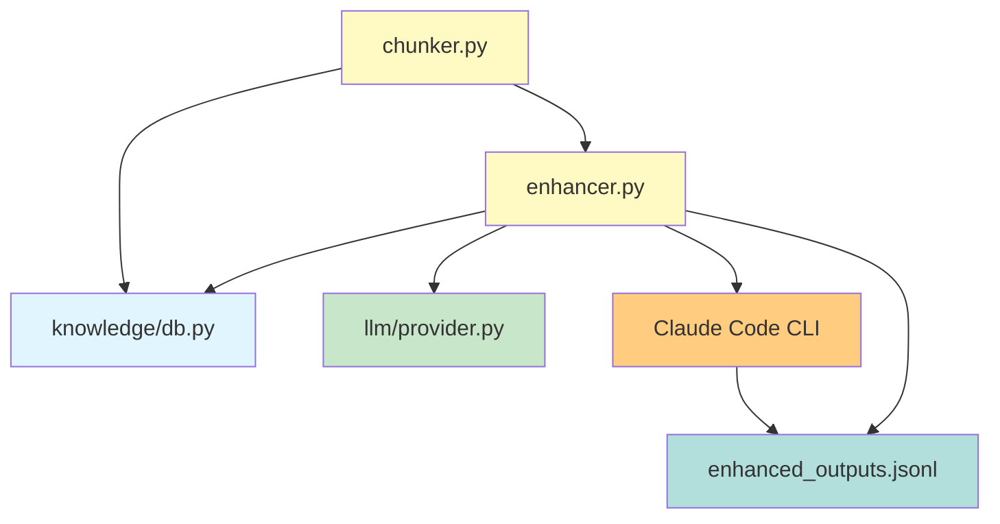

### Bot Module

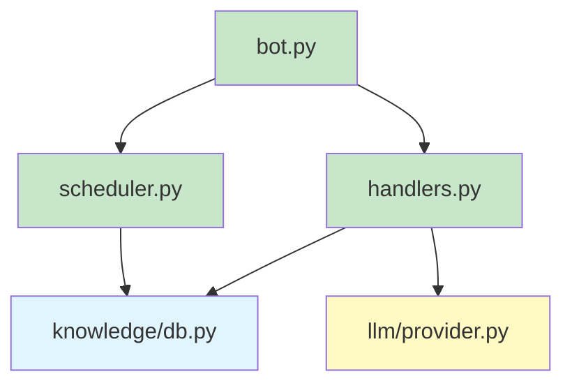

### Preview & Approval Module

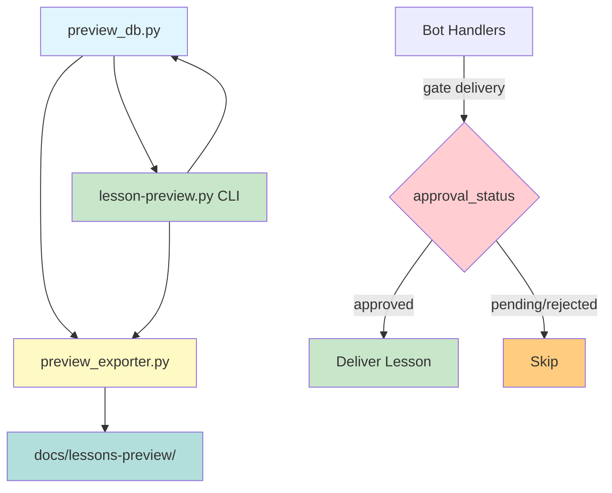

**Purpose**: Human-in-the-loop quality control before Telegram delivery

**Workflow**:
1. Pipeline completes lesson → `approval_status = "pending"`
2. `lesson-preview.py export` → Markdown files with YAML frontmatter
3. Human review → `lesson-preview.py approve/reject`
4. Bot handlers → Only deliver `approval_status = "approved"`
5. Scheduled jobs → Skip non-approved lessons automatically

**CLI Commands**:
```bash
python scripts/lesson-preview.py export              # Export all pending
python scripts/lesson-preview.py list --status pending  # Review queue
python scripts/lesson-preview.py show --id 5          # View content
python scripts/lesson-preview.py approve --id 5       # Approve single
python scripts/lesson-preview.py approve --all        # Bulk approve
python scripts/lesson-preview.py sync                 # Re-export changed
```

**Markdown Frontmatter**:
```yaml
---
lesson_id: 1
lesson_type: concept
approval_status: pending
exported_at: "2026-02-28T02:03:03.895762+00:00"
content_hash: 3746c5b3a27d
chapter_number: 1
section_number: 1
---
```

---

## LLM Provider Architecture

```mermaid
classDiagram
    class LLMProvider {
        <<interface>>
        +generate(system, user, history) str
        +generate_with_tools(system, user, tools) str
    }

    class AnthropicProvider {
        -client: Anthropic
        -model: str
        -request_delay: float
        +generate(system, user, history) str
    }

    class OpenAIProvider {
        -client: OpenAI
        -model: str
        -base_url: str
        +generate(system, user, history) str
    }

    LLMProvider <|.. AnthropicProvider
    LLMProvider <|.. OpenAIProvider

    class build_enhancement_provider() {
        Returns AnthropicProvider for Claude Haiku
    }

    class build_qa_provider() {
        Returns OpenAIProvider for DeepSeek
    }

    build_enhancement_provider ..> AnthropicProvider
    build_qa_provider ..> OpenAIProvider
```

---

## Message Flow: Lesson Delivery

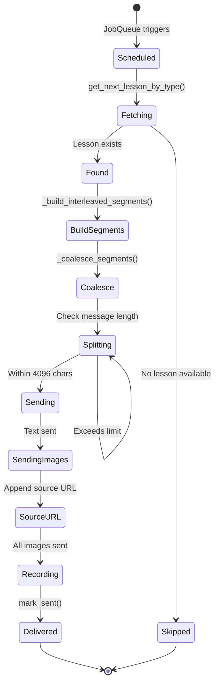

---

## Formula Rendering Subsystem

**Purpose**: Convert LaTeX formulas in lessons to PNG images for Telegram delivery

**Architecture**: Two-tier rendering system optimized for quality and performance

### Rendering Decision Tree

| Condition | Renderer | Template | Speed | Quality |
|-----------|----------|----------|-------|---------|
| Single formula (1-5 in lesson) | pdflatex | Standard article | Fast | High |
| Multiple nearby formulas (>5, <300 char gap) | xelatex + fontspec | minipage(12cm) block | Slower | High (UTF-8) |
| Same formula appears multiple times | MD5 cache | N/A | Instant | N/A |

### Single Formula Rendering

```latex
\documentclass{article}
\usepackage[utf8]{inputenc}
\usepackage{amsmath,amssymb}
\pagestyle{empty}
\begin{document}
$<formula>$
\end{document}
```

**Process**:
1. Write temporary `.tex` file
2. Run `pdflatex` → `.pdf`
3. Run `pdftoppm` (poppler) → `.png` at configurable DPI

### Combined Block Rendering

**Trigger**: 2+ formulas within 300-character proximity

**Template**:
```latex
\documentclass{article}
\usepackage[utf8]{inputenc}
\usepackage{fontspec}
\setmainfont{DejaVu Serif}
\usepackage{amsmath,amssymb}
\pagestyle{empty}
\begin{document}
\begin{minipage}{12cm}
  $<formula_1>$

  ... text/formula interleaving ...

  $<formula_n>$
\end{minipage}
\end{document}
```

**Advantages**:
- UTF-8 Vietnamese support via fontspec
- Proper spacing and alignment for multiple formulas
- Single image avoids Telegram spam
- Reduced image count (max 50 blocks/lesson)

### Block Dictionary Format

Each rendered block stored in `math_images_json` as:

```json
[
  {
    "type": "single",
    "path": "data/images/a1b2c3.png",
    "start": 234,
    "end": 250
  },
  {
    "type": "combined",
    "path": "data/images/cb_d4e5f6.png",
    "start": 450,
    "end": 800
  }
]
```

**Fields**:
- `type`: `"single"` (pdflatex) or `"combined"` (xelatex)
- `path`: Full path to PNG image
- `start`, `end`: Character positions in original content (for segmentation during delivery)

### Caching & Filename Convention

**MD5 Hash Caching**: Formulas cached by MD5(formula_text) to avoid re-rendering

**Filename Convention**:
- Single formula: `{md5_hash}.png`
- Combined block: `cb_{md5_hash}.png` (cb = combined block)

**Cache Invalidation**: Delete `.png` files in `data/images/` if DPI config changes

### Configuration

In `config.yaml`:

```yaml
renderer:
  output_dir: data/images/
  dpi: 1200              # Resolution for PNG output
  max_blocks_per_lesson: 50
  group_max_gap: 300     # Characters to consider formulas "nearby"
```

### Grouping Logic

Function: `_group_nearby_formulas(max_gap=300)`

```
Formula A at pos 0-20    } gap 50 chars
Formula B at pos 70-90   } gap 200 chars
Formula C at pos 290-310 ─ Combined into 1 block

Formula D at pos 400-420 ─ Separate block (gap 90 > 300 threshold)
Formula E at pos 510-530
```

### Real LaTeX Filter

Function: `_is_real_latex(formula)`

Rejects false positives:
- Plain text (no operators)
- Single variable: `$x$` → skip
- Numbers only: `$123$` → skip
- Common abbreviations (not LaTeX): `$P.S.$` → skip

Accepts:
- Math operators: `$E=mc^2$` ✓
- Multi-variable: `$\alpha + \beta$` ✓
- Greek letters: `$\Delta T$` ✓
- Complex expressions: `$\int_0^\infty e^{-x} dx$` ✓

---

## Table Rendering Subsystem

**See**: [Table Rendering Feature](./table-rendering.md)

**Quick Summary**:
- Detects markdown tables in lesson content via regex pattern (header | separator | rows)
- Converts markdown tables to LaTeX tabular environment
- Renders as PNG using xelatex with filename prefix `tbl_`
- Stores in unified `math_images_json` block dictionary with `type: "table"`
- MD5-based caching; cap: 20 tables per lesson
- Interleaved delivery via handlers (no special code needed)

---

## Error Handling Strategy

### Circuit Breaker Pattern (Crawler)

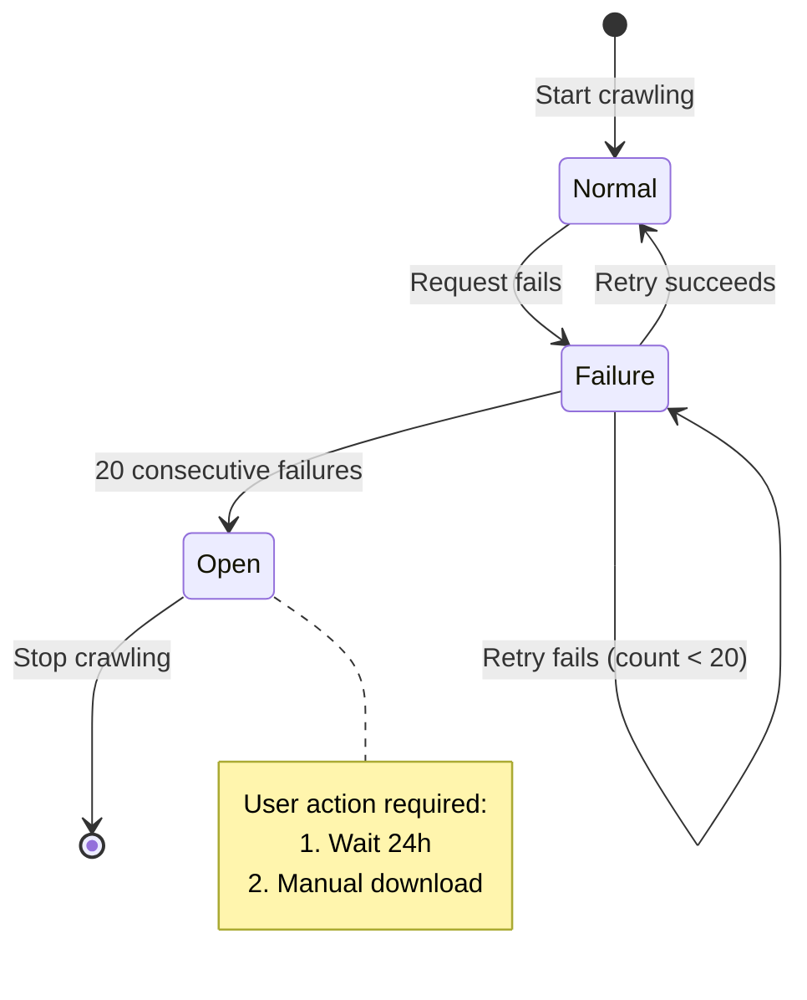

### Graceful Degradation (Rendering)

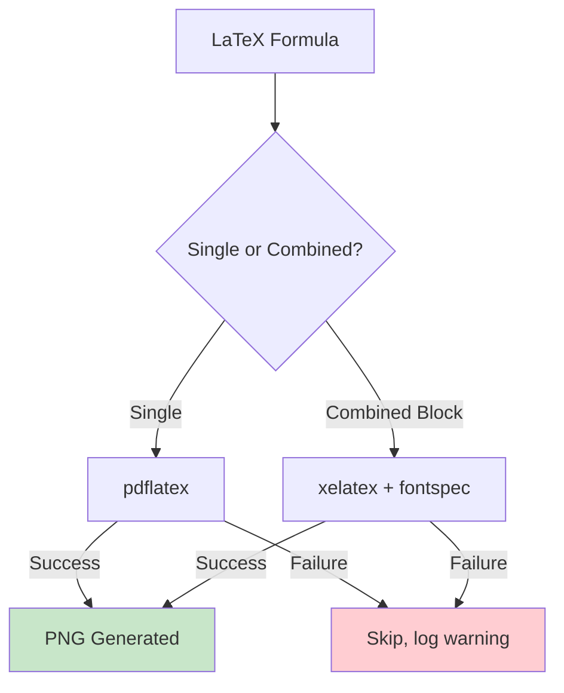

---

## Deployment Architecture

### Development

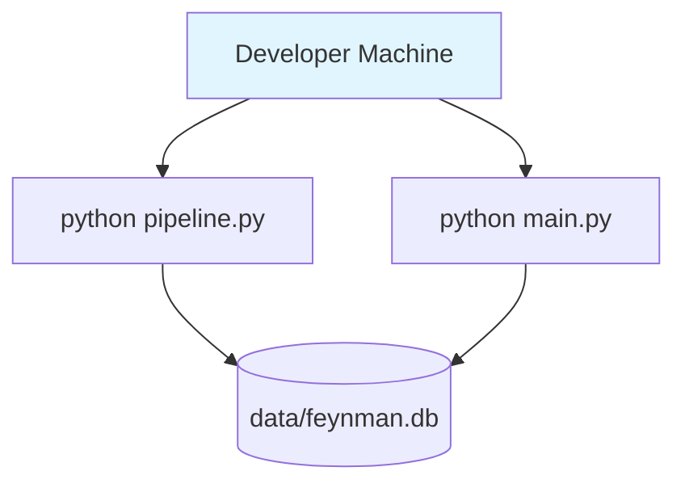

### Production (systemd)

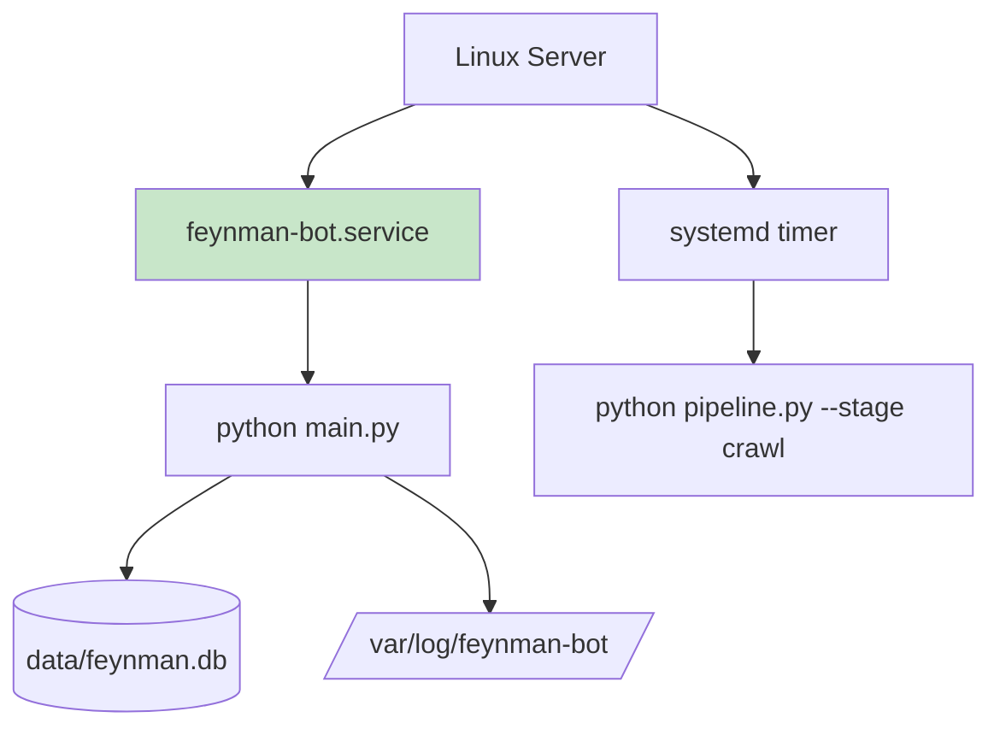

---

## Security Architecture

```mermaid
graph TB
    subgraph "Environment Variables"
        ENV[.env file]
    end

    subgraph "Configuration"
        CONFIG[config.yaml]
    end

    subgraph "Application"
        APP[Python Application]
    end

    subgraph "External APIs"
        ANTH[Anthropic API]
        CLAUDE[Claude Code CLI]
        DEEP[DeepSeek API]
        TG[Telegram API]
    end

    ENV -->|load_config| CONFIG
    CONFIG -->|${VAR} resolution| APP
    APP -->|API Key| ANTH
    APP -->|Claude Code| CLAUDE
    APP -->|API Key| DEEP
    APP -->|Token| TG

    style ENV fill:#ffcdd2
    style ANTH fill:#fff9c4
    style CLAUDE fill:#ffcc80
    style DEEP fill:#fff9c4
    style TG fill:#fff9c4
```

---

## Scalability Considerations

### Current Limitations

| Component | Limitation | Impact |
|-----------|------------|--------|
| SQLite | Single-writer concurrency | Bottleneck at 10+ concurrent users |
| Single chat_id | One user per deployment | Not multi-user ready |
| Sequential LLM calls | Slow enhancement pipeline | Hours for full volume |
| No caching | Repeated rendering | Wasted computation |

### Future Scaling Paths

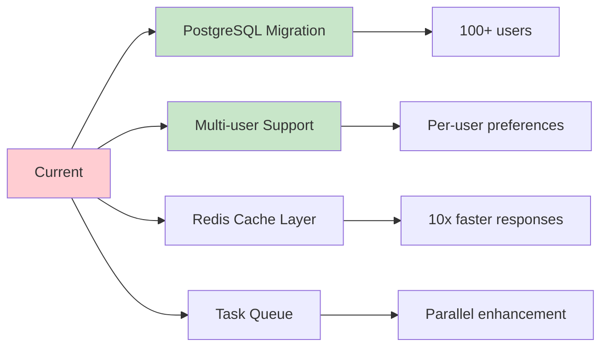

---

## Monitoring & Observability

Logging via Python `logging` module → `data/feynman-bot.log` + stdout/stderr (systemd journalctl / Docker logs).

| Component | Levels | Examples |
|-----------|--------|----------|
| Crawler | INFO, WARNING, ERROR | Pages crawled, failures |
| Parser | DEBUG, INFO | Sections extracted |
| Enhancer | INFO, ERROR | Lessons enhanced |
| Bot | INFO, WARNING | Commands executed |
| Scheduler | INFO, WARNING | Jobs scheduled |
