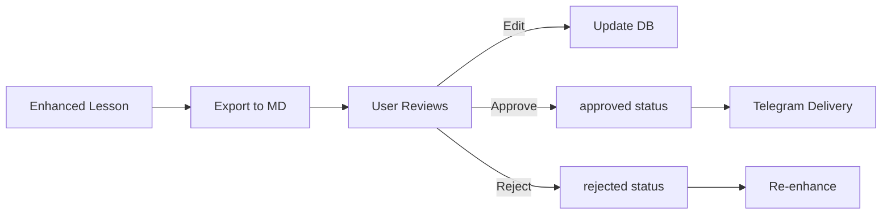

# Lesson Preview Markdown Generator

## Overview

System to export completed lessons from SQLite database to human-readable markdown files for preview, manual editing, and approval before Telegram delivery.

## Problem Statement

- Lessons exist in `data/feynman.db` with `enhancement_status='completed'`
- User cannot preview content before delivery
- No way to manually edit/refine content
- No approval workflow before Telegram Bot sends lessons

## Solution

Export pipeline that:
1. Queries completed lessons from database
2. Generates structured markdown files in `docs/lessons-preview/`
3. Tracks approval status via frontmatter metadata
4. Provides CLI tool for export/approve/reject operations

## Phases

| Phase | Description | Status | Effort |
|-------|-------------|--------|--------|
| [Phase 1](#phase-1-database-layer) | Database query functions | Completed | 1h |
| [Phase 2](#phase-2-markdown-exporter) | Markdown generation | Completed | 1.5h |
| [Phase 3](#phase-3-cli-tool) | CLI interface | Completed | 1h |
| [Phase 4](#phase-4-integration) | Integration & testing | Completed | 0.5h |

---

## Phase 1: Database Layer

**File:** `src/knowledge/preview_db.py`

### Functions to Add

```python
async def get_completed_lessons() -> list[Lesson]
async def get_completed_lessons_by_type(lesson_type: str) -> list[Lesson]
async def get_lesson_with_context(lesson_id: int) -> dict
async def update_lesson_approval_status(lesson_id: int, status: str)
```

### Key Details
- Join with sections/chapters for full context
- Filter by `enhancement_status='completed'`
- Add `approval_status` column to lessons table (migration)

---

## Phase 2: Markdown Exporter

**File:** `src/content/preview_exporter.py`

### Markdown Structure

```markdown
---
lesson_id: 2
lesson_type: deep_dive
chapter: "Chapter 1: Atoms in Motion"
section: "Introduction to Atomic Theory"
approval_status: pending
exported_at: 2026-02-28T07:48:00
---

# [Title from content_enhanced]

[content_enhanced with LaTeX formulas]

## Quiz (if lesson_type == 'quiz')
[quiz_json formatted as questions]
```

### Features
- YAML frontmatter with metadata
- LaTeX formulas preserved ($...$ and $$...$$)
- Quiz lessons: format quiz_json as structured questions
- File naming: `{lesson_id:04d}-{type}-{slug}.md`
- Slug derived from chapter + section title

---

## Phase 3: CLI Tool

**File:** `scripts/lesson-preview.py`

### Commands

```bash
# Export all completed lessons
python scripts/lesson-preview.py export

# Export specific lesson
python scripts/lesson-preview.py export --id 5

# Export by type
python scripts/lesson-preview.py export --type concept

# Approve lesson (updates approval_status in DB)
python scripts/lesson-preview.py approve --id 5

# Reject lesson (marks for re-enhancement)
python scripts/lesson-preview.py reject --id 5 --reason "needs more examples"

# List pending approvals
python scripts/lesson-preview.py list --status pending

# Sync: re-export lessons where content changed
python scripts/lesson-preview.py sync
```

---

## Phase 4: Integration

### Directory Structure

```
docs/
├── lessons-preview/
│   ├── 0001-concept-atoms-in-motion.md
│   ├── 0002-deep-dive-atomic-theory.md
│   ├── 0003-quiz-atoms-basics.md
│   └── ...
└── ...
```

### Database Migration

Add `approval_status` column to `lessons` table:
```sql
ALTER TABLE lessons ADD COLUMN approval_status TEXT DEFAULT 'pending';
-- Values: pending, approved, rejected
```

### Workflow



---

## Key Constraints

- Keep markdown files under 800 LOC (split if needed)
- File names: kebab-case, max 50 chars
- LaTeX syntax preserved for Telegram rendering
- No API keys or secrets in preview files
- Async-compatible (use aiosqlite)

---

## Dependencies

- Existing: `src/knowledge/db.py`, `src/knowledge/models.py`
- New: `src/knowledge/preview_db.py`, `src/content/preview_exporter.py`
- CLI: `scripts/lesson-preview.py`

---

## Success Criteria

- [ ] Export command generates all completed lessons to `docs/lessons-preview/`
- [ ] Markdown files contain valid YAML frontmatter
- [ ] Quiz lessons formatted with structured questions
- [ ] Approve/reject commands update database
- [ ] List command shows approval status
- [ ] Sync detects content changes and re-exports

---

## Risk Assessment

| Risk | Mitigation |
|------|------------|
| Large lessons exceed 800 LOC | Auto-split into part-1, part-2 |
| LaTeX formulas not rendered | Keep raw LaTeX, render at Telegram time |
| Manual edits lost on re-export | Check modification timestamp before overwrite |
| Approval status not synced | Store in DB, use as source of truth |

---

## Open Questions

1. Should approved lessons auto-delete preview files? (Recommend: No, keep for reference)
2. Track edit history in DB? (Recommend: No, YAGNI for now)
3. Support bulk approve/reject? ✅ **Decided: Yes** — add `--all` flag (Session 1)

---

## Validation Log

### Session 1 — 2026-02-28
**Trigger:** Initial plan validation before implementation
**Questions asked:** 4

#### Questions & Answers

1. **[Architecture]** The plan shows 'approved → Telegram Delivery' but doesn't specify how this connects. Should the Telegram bot be modified to check approval_status before sending lessons?
   - Options: Yes, gate delivery on approved status | No, approval is manual reference only | Out of scope, add as Phase 5
   - **Answer:** Yes, gate delivery on approved status
   - **Custom input:** "Chỉ những lesson đã được human review and approved thì mới được gửi đi cho Telegram Bot" (Only lessons that have been human reviewed and approved should be sent to the Telegram Bot)
   - **Rationale:** Bot handlers must filter by `approval_status='approved'` before delivering lessons. Requires modifying `src/bot/handlers.py`. Phase 4 must include this change.

2. **[Scope]** When a lesson is rejected, should rejection automatically trigger re-enhancement or just mark the status?
   - Options: Just mark status, manual re-enhance later | Auto-reset enhancement_status to trigger re-enhance
   - **Answer:** Just mark status, manual re-enhance later
   - **Rationale:** Keeps scope simple. Rejected lessons need human review before re-enhancement anyway.

3. **[Architecture]** Should the docs/lessons-preview/ directory be committed to git or gitignored?
   - Options: Gitignore it — generated files | Commit to git — enables review via PR/diff
   - **Answer:** Commit to git — enables review via PR/diff
   - **Rationale:** Preview files act as an audit trail for content review. The commented-out gitignore in Phase 2 should be removed entirely.

4. **[Scope]** Should we add --all flag for bulk approve/reject operations?
   - Options: Yes, add --all flag | No, keep single-lesson only (YAGNI)
   - **Answer:** Yes, add --all flag
   - **Rationale:** Useful for batch onboarding. Phase 3 CLI must implement `approve --all` and `reject --all`.

#### Confirmed Decisions
- **Bot delivery gating**: approved status required — bot handlers must check `approval_status='approved'`
- **Rejection flow**: mark status only, no auto re-enhance
- **Git tracking**: commit `docs/lessons-preview/` to git
- **Bulk ops**: implement `--all` flag in Phase 3

#### Action Items
- [ ] Phase 3: Add `--all` flag to `approve` and `reject` commands
- [ ] Phase 4: Add bot handler modification task (filter by `approval_status='approved'`)
- [ ] Phase 2: Remove commented-out gitignore suggestion for `docs/lessons-preview/`
- [ ] Phase 4: Remove "No bulk approve/reject" from Known Limitations

#### Impact on Phases
- Phase 3: Add `--all` flag to approve/reject commands
- Phase 4: Add bot handler gating task + remove gitignore note + update Known Limitations
